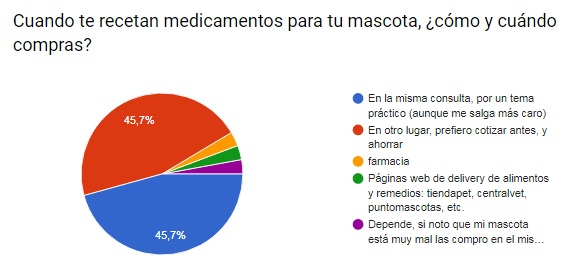

# Farmapet

Es un catálogo online de venta de medicamentos para mascotas

Lo que a continuación se presenta es el MVP

## Descubrimiento e Investigación

### User Research
#### Encuestas y entrevistas

Comenzamos haciendo encuestas online para averiguar los comportamientos de compra de los usuarios.

Cuando sus mascotas son llevadas al veterinario y les recetan medicamentos, el XXXXX% prefiere comprar en el mismo lugar, por lo práctico.
Pero el XXX% restante prefiere comprar después y cotizar, con el fin de ahorrar. A ese público le sumamos un 3,2% que preiere comprar a través de páginas web de petshops, lo que da un total del XXX% que tiene como prioridad el presupuesto antes que la inmediatez.

Ante la pregunta "¿Conoces alguna página web dónde cotizar medicamentos online?", un XXXX% respondió negativamente y solo un XX% respondió que sí.

Estos dos factores consideramos que son importantes, ya que es un público no menor el que no puede darse el lujo de perder dinero por no cotizar antes. 

FOTO GRAFICO

Existe otro público, más específico, que son los dueños de mascotas que tienen enfermedades específicas y que deben consumir medicamentos de por vida, el que corresponde a un 35,5%. Algunas de estas enermedades mencionadas por los propios afectados son distemper, tumores, artrosis, hipotiroidismo, epilepsia, gingivitis estomatitis, hipertensión, déficit de potasio e insuficiencia cardiaca.

Consultando directamente con Johanna Olavarría, veterinaria, nos comentó que si bien mucha gente compra en la misma clínica (si es que ésta tiene los medicamentos), pero que hay otro público importante, de menos presupuesto, que prefiere comprar en otro lugar y primero estudiar los precios. Ocurre también en casos donde el veterinario va a domicilio. 

#### Análisis de mercado

Buscando en internet, descubrimos dos casos de venta web de medicamentos, pero ambos tienen sus falencias.
El primer caso es arkanet.cl, en donde tienen un catálogo y algunos de sus productos se venden bajo receta médica. En este caso, para el usuario, el flujo de compra es el tradicional: escoge el producto, lo agrega al carrito, y paga. Y la receta debe ser enviada aparte, vía Whatsapp o por correo electrónico, o sino entregarla en la misma tienda a la hora del retiro.

El segundo caso es puntomascotas.cl, pero en su catálogo no tienen productos con receta, por lo que la variedad es muy limitada.

Existen otras webs de tiendas que venden estos productos, pero sin catálogo. La sección se limita a un texto informativo donde cuentan qué tipo de medicamentos venden, o las marcas o solo los datos de atención de la tienda.

### Definición del problema
